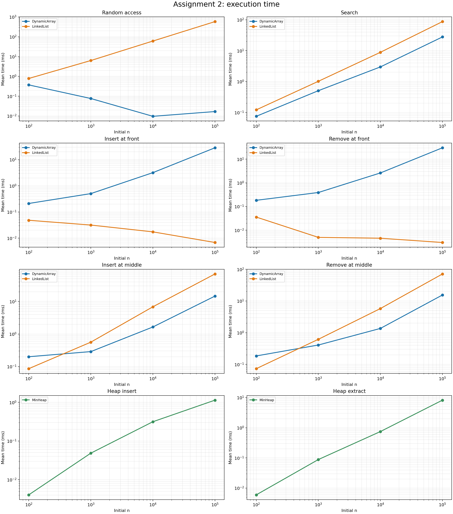
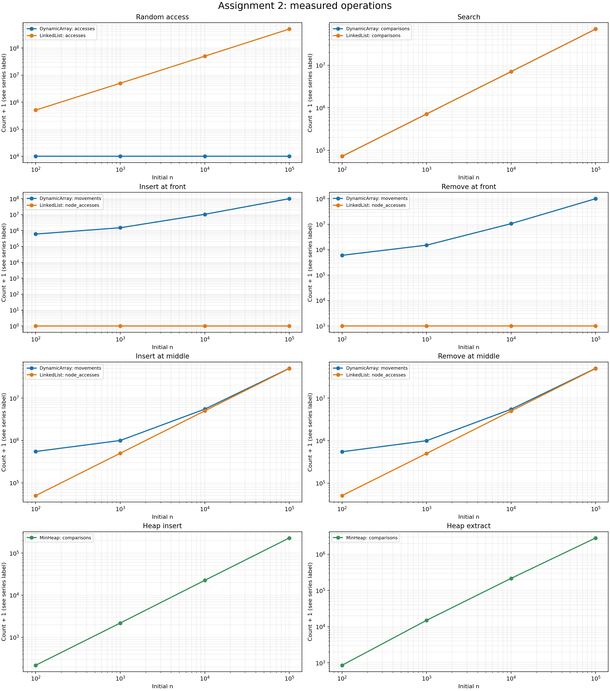

# Assignment 2 — Algorithmic Analysis, Correctness and Performance Trade-offs

**Student:** Daniyal Akylbek · **Group:** SE-2530  
**Language:** Java 17 · **Seed:** 42 · **Trials:** 5 per experiment

## 1. Overview

This project implements an integer dynamic array, singly linked list with a tail pointer, and binary min-heap without using Java collections internally. Java's `ArrayList` and `PriorityQueue` serve only as correctness oracles in `Tests.java`. `Benchmark.java` evaluates four controlled workloads and writes raw measurements to `results/tables/benchmark.csv`.

## 2. Complexity analysis

Here `n` is the current number of stored elements and `m` the number of workload operations. Every entry below is a **tight Θ bound for the stated case**, so it also supplies a corresponding O upper bound and Ω lower bound. For example, worst-case dynamic-array search is simultaneously O(n), Ω(n), and Θ(n); the best-case search is Θ(1) and hence Ω(1). Average assumes a uniformly selected valid index or a search key with a fixed nonzero probability of being absent. Auxiliary space excludes the persistent backing array or nodes unless explicitly stated.

| Structure | Operation | Best | Average | Worst | Auxiliary space |
|---|---|---|---|---|---|
| Dynamic array | `add(x)` | Θ(1) | amortized Θ(1) | Θ(n) on growth | Θ(1); Θ(n) transient on growth |
| Dynamic array | `add(index,x)` | Θ(1) | Θ(n) | Θ(n) | Θ(1); Θ(n) transient on growth |
| Dynamic array | `remove(index)` | Θ(1) | Θ(n) | Θ(n) | Θ(1) |
| Dynamic array | `get(index)` | Θ(1) | Θ(1) | Θ(1) | Θ(1) |
| Dynamic array | `contains(x)` | Θ(1) | Θ(n) | Θ(n) | Θ(1) |
| Linked list | `add(x)` | Θ(1) | Θ(1) | Θ(1) | Θ(1) new node |
| Linked list | `add(index,x)` | Θ(1) at head or tail | Θ(n) | Θ(n) | Θ(1) new node |
| Linked list | `remove(index)` | Θ(1) at head | Θ(n) | Θ(n) | Θ(1) |
| Linked list | `get(index)` | Θ(1) at head | Θ(n) | Θ(n) | Θ(1) |
| Linked list | `contains(x)` | Θ(1) | Θ(n) | Θ(n) | Θ(1) |
| Min-heap | `insert(x)` | Θ(1) | expected amortized Θ(1)* | Θ(n) with resize; Θ(log n) without | Θ(1); Θ(n) transient on growth |
| Min-heap | `peekMin()` | Θ(1) | Θ(1) | Θ(1) | Θ(1) |
| Min-heap | `extractMin()` | Θ(1) | Θ(log n) | Θ(log n) | Θ(1) |

\* The expected Θ(1) for insertion assumes independent, identically distributed random priorities: the expected number of ancestors moved is bounded; for adversarial input it can be Θ(log n) without capacity growth. The heap doubles its backing array on demand, making an individual resize Θ(n), although copying is amortized across insertions. The benchmark reserves `n` heap slots to isolate heap ordering costs; its insertion workload has an O(n log n) general bound, but random data gave approximately linear total comparisons. `extractMin()` never shrinks storage.

For array insertion/removal, shifting elements dominates as the position moves toward the front. The linked list changes pointers in constant time once it has the predecessor, but finding a middle predecessor costs Θ(n). Its tail pointer makes append constant time, whereas removing the last node still takes Θ(n). The array's contiguous memory makes indexing constant time and usually makes sequential scans faster than an equal-comparison pointer traversal.

## 3. Correctness: loop invariants

### Dynamic-array insertion shift (`add(index,x)`)

Let the original size be `s`, the original items be `A[0..s-1]`, and `index = k` with `0 ≤ k ≤ s`. Capacity is sufficient before the loop. At the start of each iteration with `i` descending from `s` to `k+1`, the suffix `data[i+1..s]` contains, in order, the original elements `A[i..s-1]`; cells `data[0..i-1]` still contain their original values. Cell `i` is the next destination.

- **Initialization:** At `i=s`, the copied suffix `data[s+1..s]` is empty and every old cell is unchanged. The statement holds vacuously.
- **Maintenance:** The loop executes `data[i] = data[i-1]`. This places original `A[i-1]` into its final position, extends the preserved suffix to `data[i..s]`, and does not modify cells below `i-1`. Thus the invariant holds when `i` decreases by one.
- **Termination:** The integer `i` decreases and stops after `i=k+1`, so the loop terminates. The invariant then establishes `data[k+1..s] = A[k..s-1]` and `data[0..k-1] = A[0..k-1]`. Setting `data[k]=x` and increasing `size` gives exactly the desired sequence. If `k=s`, there are zero iterations and the same conclusion holds.

### Heap extraction sift-down (`extractMin()`)

Before extraction the tree satisfies the heap property, so the root is a minimum. Save the root as `answer`, remove the last item as `last`, and treat the root as a hole. At the top of each iteration, **every subtree except possibly at the hole is a valid min-heap**; `last` is the only unplaced value; and the values copied along the root-to-hole path are no larger than their new children other than the hole.

- **Initialization:** Removing the root and last item leaves all other parent-child relationships intact. The root is the only hole, so all other subtrees remain heaps.
- **Maintenance:** If the hole has children, choose the smaller child (compare both if there are two). If `last` is no larger than that child, it is no larger than either child and can fill the hole. Otherwise copy the smaller child into the hole: it is no larger than its sibling, and its former children were no smaller than it in the original valid subtree. The copied value is also at least the value copied into the hole's old parent along the path. Move the hole to that child's previous location; the invariant remains true.
- **Termination:** Each continuing iteration moves one level down a finite tree; it eventually encounters a leaf or a child no smaller than `last`. Putting `last` in the hole restores heap order there and, by the invariant, everywhere else. The saved `answer` was the original minimum, so the returned value is correct. The size-zero and size-one cases are handled before the loop.

## 4. Experimental setup

All applicable workloads use `n ∈ {100, 1,000, 10,000, 100,000}` and five trials. For each `n`, random input values come from `new Random(42)` in `[0, 2n-1]`. Queries and indices also use fixed seed 42. Values, indices, structures, and any removal preparation are created **before** `System.nanoTime()` starts. Only the requested operation loop is timed. The reported time is the arithmetic mean of the five total operation-loop durations, in milliseconds. Counters are reset before timing and averaged across trials. Untimed warmup executes each operation first; no printing or plotting occurs in the timed sections. Times can vary with JVM optimization, CPU load, and garbage collection.

| Workload | Operations `m` | Additional metric |
|---|---:|---|
| Random access | 10,000 `get` calls per structure | Array element reads; list node visits |
| Search | 1,000 `contains` calls per structure | Key comparisons; 500 hits and 500 guaranteed misses, shuffled |
| Front or middle insertion | 1,000 indexed insertions | Array element copies; list node visits |
| Front or middle removal | 1,000 indexed removals | Array element copies; list node visits |
| Priority processing | `n` inserts, then `n` extracts | Heap key comparisons per phase; checks sorted extraction |

**Small-`n` removal clarification:** the specification requests 1,000 removals even for an initial `n=100`, which is impossible if the original structure is simply restored. Each removal trial therefore begins with the original `n` items **plus 1,000 items inserted at the tested position before timing**. Its 1,000 timed removals return it to its original `n` items. `index=n/2` remains fixed during middle operations, as specified. Every structure uses identical values and indices. For insertion, preallocated array capacity avoids counting resize cost so comparisons reflect shifts and traversal. In heap insertion, preallocated capacity isolates heap comparisons.

Counters count algorithmically meaningful work: array `accesses` counts requested reads, array `movements` counts copied existing elements, list `node_accesses` counts visited nodes (zero for a head insertion), and heap `comparisons` counts ordering comparisons between keys. A list head removal reads one node. The metrics have different units across structures in the edit plots, so compare their trends and times rather than equating one node visit with one integer copy. The timings include counter increments and heap extraction order checking.

## 5. Measured results

The full machine-readable table is [benchmark.csv](results/tables/benchmark.csv). Entries in the following tables show **mean milliseconds / mean metric count**; theory applies to the complete `m`-operation workload. Plots use logarithmic axes. The operation-count plot displays count + 1 so zero node visits remain visible; the table and CSV give the actual count.





### Random access (10,000 gets)

| n | Dynamic array ms / metric | Linked list ms / metric | Theory: array; list |
|---:|---:|---:|---|
| 100 | 0.373 / 10,000 | 0.788 / 511,508 | Theta(m); Theta(m*n) |
| 1,000 | 0.077 / 10,000 | 6.333 / 5,015,208 | Theta(m); Theta(m*n) |
| 10,000 | 0.010 / 10,000 | 61.064 / 50,139,208 | Theta(m); Theta(m*n) |
| 100,000 | 0.017 / 10,000 | 583.824 / 502,499,208 | Theta(m); Theta(m*n) |

### Search (1,000 queries)

| n | Dynamic array ms / metric | Linked list ms / metric | Theory: array; list |
|---:|---:|---:|---|
| 100 | 0.075 / 72,324 | 0.122 / 72,324 | Theta(m*n); Theta(m*n) |
| 1,000 | 0.507 / 715,826 | 1.021 / 715,826 | Theta(m*n); Theta(m*n) |
| 10,000 | 2.980 / 7,060,787 | 8.855 / 7,060,787 | Theta(m*n); Theta(m*n) |
| 100,000 | 27.801 / 70,464,608 | 87.027 / 70,464,608 | Theta(m*n); Theta(m*n) |

### Insertion at index 0 (1,000 inserts)

| n | Dynamic array ms / metric | Linked list ms / metric | Theory: array; list |
|---:|---:|---:|---|
| 100 | 0.212 / 599,500 | 0.048 / 0 | Theta(m*n+m^2); Theta(m) |
| 1,000 | 0.504 / 1,499,500 | 0.032 / 0 | Theta(m*n+m^2); Theta(m) |
| 10,000 | 3.191 / 10,499,500 | 0.017 / 0 | Theta(m*n+m^2); Theta(m) |
| 100,000 | 28.467 / 100,499,500 | 0.007 / 0 | Theta(m*n+m^2); Theta(m) |

### Removal at index 0 (1,000 removals)

| n | Dynamic array ms / metric | Linked list ms / metric | Theory: array; list |
|---:|---:|---:|---|
| 100 | 0.184 / 599,500 | 0.036 / 1,000 | Theta(m*n+m^2); Theta(m) |
| 1,000 | 0.392 / 1,499,500 | 0.005 / 1,000 | Theta(m*n+m^2); Theta(m) |
| 10,000 | 2.628 / 10,499,500 | 0.005 / 1,000 | Theta(m*n+m^2); Theta(m) |
| 100,000 | 30.299 / 100,499,500 | 0.003 / 1,000 | Theta(m*n+m^2); Theta(m) |

### Insertion at index n/2 (1,000 inserts)

| n | Dynamic array ms / metric | Linked list ms / metric | Theory: array; list |
|---:|---:|---:|---|
| 100 | 0.200 / 549,500 | 0.086 / 50,000 | Theta(m*n+m^2); Theta(m*n) |
| 1,000 | 0.288 / 999,500 | 0.562 / 500,000 | Theta(m*n+m^2); Theta(m*n) |
| 10,000 | 1.644 / 5,499,500 | 6.870 / 5,000,000 | Theta(m*n+m^2); Theta(m*n) |
| 100,000 | 14.641 / 50,499,500 | 70.183 / 50,000,000 | Theta(m*n+m^2); Theta(m*n) |

### Removal at index n/2 (1,000 removals)

| n | Dynamic array ms / metric | Linked list ms / metric | Theory: array; list |
|---:|---:|---:|---|
| 100 | 0.185 / 549,500 | 0.073 / 51,000 | Theta(m*n+m^2); Theta(m*n) |
| 1,000 | 0.409 / 999,500 | 0.620 / 501,000 | Theta(m*n+m^2); Theta(m*n) |
| 10,000 | 1.365 / 5,499,500 | 5.787 / 5,001,000 | Theta(m*n+m^2); Theta(m*n) |
| 100,000 | 15.493 / 50,499,500 | 71.283 / 50,001,000 | Theta(m*n+m^2); Theta(m*n) |

### Heap insertion (n inserts)

| n | Heap ms / comparisons | Theory |
|---:|---:|---|
| 100 | 0.004 / 217 | O(n*log(n)) |
| 1,000 | 0.049 / 2,188 | O(n*log(n)) |
| 10,000 | 0.315 / 22,582 | O(n*log(n)) |
| 100,000 | 1.138 / 229,018 | O(n*log(n)) |

### Heap extraction (n extracts)

| n | Heap ms / comparisons | Theory |
|---:|---:|---|
| 100 | 0.006 / 858 | Theta(n*log(n)) |
| 1,000 | 0.088 / 14,995 | Theta(n*log(n)) |
| 10,000 | 0.747 / 216,644 | Theta(n*log(n)) |
| 100,000 | 8.209 / 2,831,804 | Theta(n*log(n)) |

## 6. Discussion and performance analysis

- **Access:** Array read count remains 10,000 as `n` increases. List traversal visits grow from roughly 0.5 million to roughly 502 million nodes, consistent with Θ(mn) versus Θ(m). The timings follow the same overall direction; the small `n` array timings reflect JIT and clock noise.
- **Search:** Both algorithms make exactly the same number of value comparisons on identical data, rising with `n` (about 72 thousand to 70 million). The array is faster on larger inputs because sequential contiguous reads are cheaper than following linked nodes, despite both being Θ(mn).
- **Front editing:** Arrays shift increasingly many elements while list head operations avoid traversal; this makes linked lists effective for this specific workload. At `n=100`, the additional 1,000 edits contribute a Θ(m²) shifting term, which the table records.
- **Middle editing:** The array moves about `m(n/2)+m(m-1)/2` items for fixed insertion index; the list walks approximately `m(n/2)` nodes. Even when the counts look similar, memory layout can make array copies quicker than linked-node traversal. Middle removal reverses the shift order but yields the same total count. They both scale as Θ(mn+m²) for array edits and Θ(mn) for list edits with fixed `m`.
- **Priority processing:** The heap's insertion comparisons grow close to linearly for these seeded random keys; per-insertion work has an O(log n) bound. Extraction comparisons grow more quickly, close to n log n. `peekMin` simply reads the root in Θ(1). Extraction was checked for non-decreasing output every trial, and unit tests separately check the heap property after inserts and extracts.
- **Differences from theory:** Big-O bounds growth, not exact milliseconds. Constants, memory locality, linked-node allocations, CPU caches, JVM warmup, branch prediction, timer granularity and garbage collection affect measured duration. The theoretical metric counts give stronger evidence of growth than noisy short timings. In particular, Θ(n) array and linked-list searches can have different time even with identical comparisons.

## 7. Design recommendations

| Need | Recommended structure | Reason |
|---|---|---|
| Frequent indexed reads or scans | Dynamic array | Constant-time indexing and contiguous storage |
| Frequent insertion/removal at a known head | Linked list | Constant-time pointer changes with no shifting |
| Frequent middle position operations *given only an index* | Often dynamic array | Both traverse/shift linearly; array locality can win |
| Repeated minimum retrieval and removal | Min-heap | Constant-time peek and logarithmic extraction |

A linked list can also be useful when callers already hold a node or predecessor, although this particular API accepts an **index**, so locating a middle position still costs linear time. Choose from the workload's actual operation mix and measured performance rather than from a single complexity label.

## 8. Conclusion

The measured operation counts match the predicted growth: direct array access stays constant, list random access and both searches grow with `n`, front edits favor linked nodes, and heap extraction grows at about n log n. The relative times reveal the practical effect of data layout and constant factors on operations with similar asymptotic bounds.

## Run locally

Use Java 17+ and Python 3 with `matplotlib` for the plots. From the project root:

```bash
mkdir -p out
javac -d out src/*.java
java -cp out Tests
java -cp out Benchmark
python3 plot_results.py
python3 update_report_tables.py
```

If your Java installation has the compiler module but no `javac` executable, use `java -m jdk.compiler/com.sun.tools.javac.Main -d out src/*.java`. The expected test output is `PASS: 231831 assertions`. To submit, create your own GitHub repository, make meaningful commits for implementations, tests, benchmarking, and report/plots, then push it and submit its URL. The CSV and figures supplied here are measured samples from one environment; rerun locally to obtain results for your machine. The `out/` directory is generated and excluded from the deliverable.
